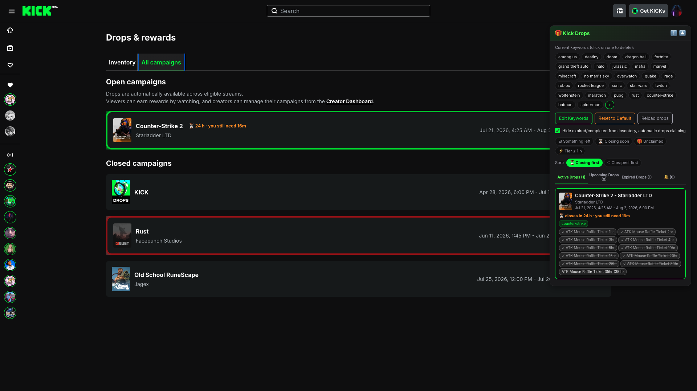
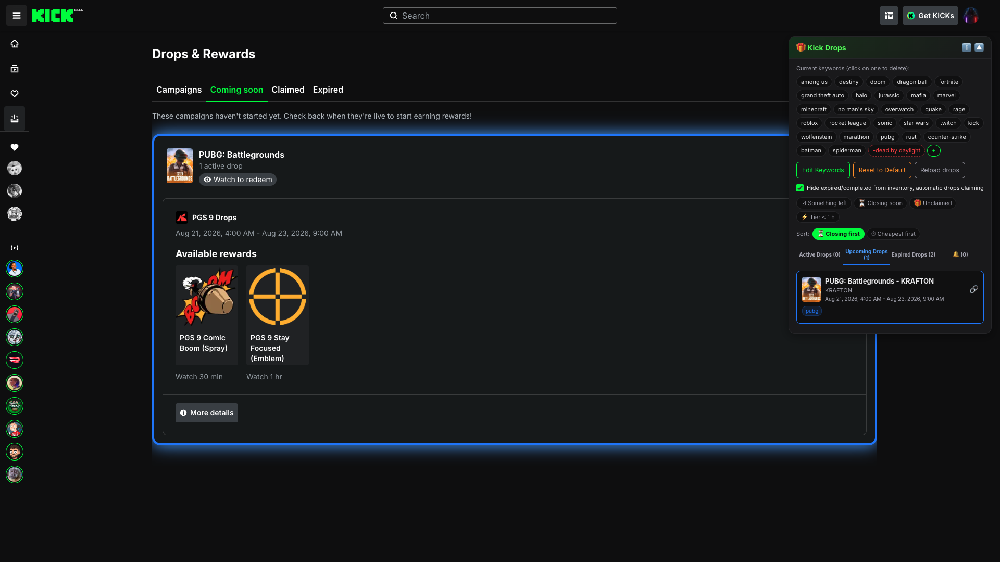
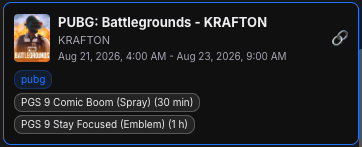
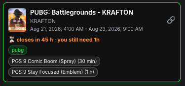
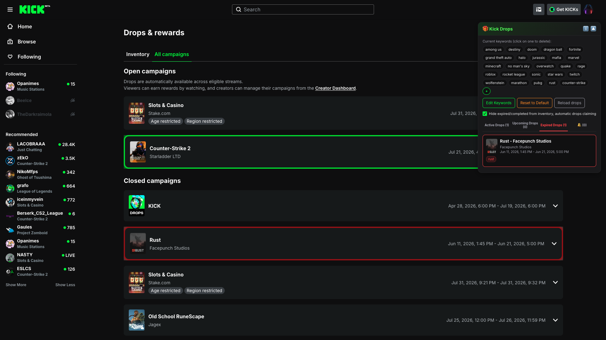
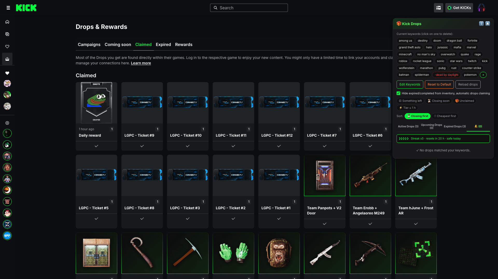
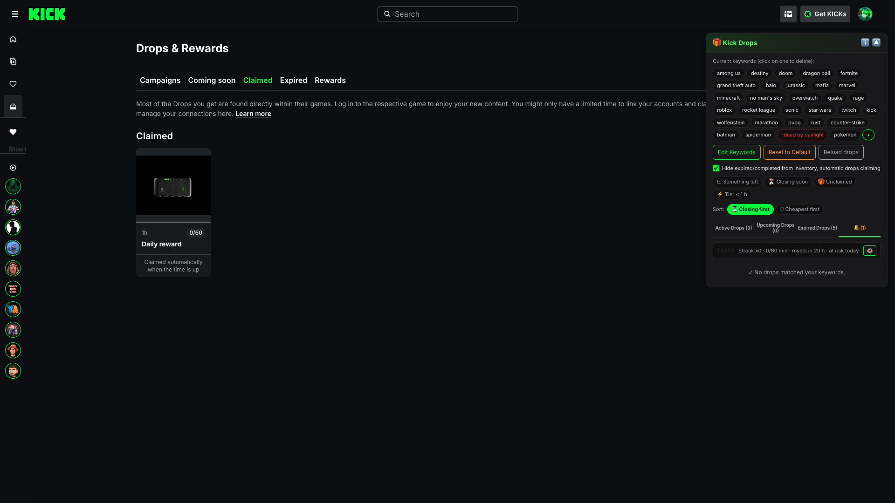
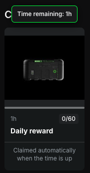
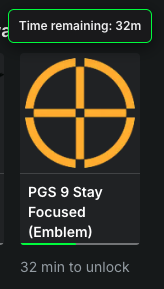
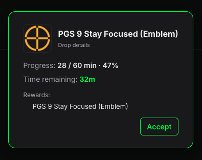

# Kick Drops Highlighter + Keywords

Tampermonkey userscript that classifies and highlights drops/campaigns on Kick based on your keywords. / Userscript de Tampermonkey que clasifica y resalta drops/campañas en Kick según tus palabras clave.

> [!NOTE]
> **ONE CHECKBOX DOES TWO THINGS / UNA CASILLA HACE DOS COSAS:** ticking *hide expired/completed* also turns on automatic claiming — of your finished **drops** and of the **daily reward chest**, which the label does not say. It claims by clicking Kick's own buttons for rewards you already earned by watching: nothing is sent to Kick's API to claim, and it grants you nothing you could not click yourself. It is still automation, which Kick's terms may not permit, so decide with that in mind. / Marcar *ocultar cerrados/completados* activa además la reclamación automática —de tus **drops** terminados y del **cofre de recompensa diaria**—, algo que la etiqueta no dice. Reclama pulsando los propios botones de Kick, sobre recompensas que ya te ganaste viendo: no se envía nada a la API de Kick para reclamar, y no te da nada que no pudieras pulsar tú. Sigue siendo automatización, que las condiciones de Kick pueden no permitir, así que decide sabiéndolo.

*Campaigns: matching campaigns get outlined **green** on the page itself, and each one says what it still costs you right there — here *PUBG: Battlegrounds* is the only thing Kick has open, so it shows **⏳ 45 h · you still need 1h** in red; a campaign with no hurry shows a plain grey **⏱** with the time instead. The panel lists the same campaigns with their rewards, the filter chips and the sort. And its three tabs read **Active 1 · Upcoming 0 · Expired 1**, which is the redesign working: the day before, that same campaign was the 1 under *Upcoming*, and *Expired* was 3 until the two it should never have listed were taken out. / Campañas: las campañas que coinciden se enmarcan en **verde** en la propia página, y cada una dice ahí mismo lo que todavía te cuesta — aquí *PUBG: Battlegrounds* es lo único que Kick tiene abierto, así que lleva **⏳ 45 h · te faltan 1h** en rojo; una campaña sin prisa lleva en su lugar un **⏱** gris con el tiempo. El panel lista esas mismas campañas con sus recompensas, las etiquetas de filtro y el orden. Y sus tres pestañas marcan **Abiertos 1 · Próximos 0 · Cerrados 1**, que es el rediseño funcionando: el día antes esa misma campaña era el 1 de *Próximos*, y *Cerrados* marcaba 3 hasta que se fueron las dos que no debía listar.*

*Coming soon: the first campaign Kick scheduled since the redesign — PUBG, opening 21 August 2026 — outlined **blue** on its own tab, with the panel's **Upcoming** counting it. That count is also what proved Kick's API returns upcoming campaigns at all: it reads 1 from the **expired** tab too, where the page has no upcoming card to read, and the scan ignores the panes Kick leaves mounted and hidden. The shot is from the day before the reward badges reached that tab, so the card here carries the title, the window and the keyword; the crop below is that same card once they arrived. / Próximas: la primera campaña que Kick programó desde el rediseño —PUBG, que abre el 21 de agosto de 2026— enmarcada en **azul** en su propia pestaña, con **Próximos** del panel contándola. Esa cuenta es además lo que probó que la API de Kick devuelve próximas: marca 1 también desde la pestaña de **cerradas**, donde la página no tiene ninguna tarjeta de próximas que leer, y el escaneo ignora los paneles que Kick deja montados y escondidos. La captura es del día antes de que los badges de recompensa llegaran a esa pestaña, así que la tarjeta de aquí lleva el título, la ventana y la palabra clave; el recorte de abajo es esa misma tarjeta ya con ellos.*

*The same upcoming card, close up: the title, the window, the `pubg` chip that found it, the 🔗 to copy it, and **what it will hand out with what each tier costs** — 30 min for the spray, 1 h for the emblem. What it deliberately does **not** carry is a deadline. PUBG opens on the 21st and closes on the 23rd, which is inside the 72 hours the script treats as urgent, so without that rule this card would have read **⏳ closes in 63 h · you still need 1 h** the day before it even opened. Nothing is urgent before it starts. The badges also come with no ✓ and no 🎁, and that is not forced either: those marks are read from your claimed-and-watched data, and a campaign that has not started has nothing claimed or earned — so if one ever showed up here, it would be real. / La misma tarjeta de próximas, de cerca: el título, la ventana, el chip `pubg` que la encontró, el 🔗 para copiarla y **lo que va a repartir con lo que cuesta cada tramo** — 30 min el spray, 1 h el emblema. Lo que a propósito **no** lleva es un plazo. PUBG abre el 21 y cierra el 23, o sea dentro de las 72 h que el script considera urgentes, así que sin esa regla esta tarjeta habría dicho **⏳ cierra en 63 h · te faltan 1 h** el día antes de abrir. Antes de que empiece no corre prisa nada. Los badges salen además sin ✓ y sin 🎁, y eso tampoco se fuerza: esas marcas se leen de tus datos de reclamado y visto, y una campaña que no ha empezado no tiene nada reclamado ni ganado — así que si alguna apareciera aquí, sería de verdad.*

*And the same card the day after, once the campaign opened: **green** now, same keyword, same two badges with the same costs — and **the deadline has appeared**, `⏳ closes in 45 h · you still need 1h`. Nothing else changed. That is the whole rule in two pictures: the countdown is not a property of the campaign, it is a property of it being open. / Y la misma tarjeta al día siguiente, ya abierta la campaña: **verde** ahora, la misma palabra clave, los mismos dos badges con el mismo coste — y **ha aparecido el plazo**, `⏳ cierra en 45 h · te faltan 1h`. No cambió nada más. Ahí está la regla entera en dos fotos: la cuenta atrás no es una propiedad de la campaña, es una propiedad de que esté abierta.*

*Expired: same idea in **red**, so a campaign that closed is obvious rather than something you find out by clicking. The tab keeps its own count, and the filters never touch it — there is nothing left to decide there. Clicking a card takes you to its own title, whether it is the game or one of its sub-campaigns. This one is from the redesigned `/drops`, where closed campaigns finally have a tab of their own: before it, they only existed inside the panel, read from the API. / Cerrados: lo mismo en **rojo**, para que una campaña que ya cerró se vea, en vez de descubrirlo al hacer clic. La pestaña lleva su propia cuenta, y los filtros no la tocan: ahí ya no hay nada que decidir. Al pulsar una tarjeta te lleva a su propio título, sea el del juego o el de una de sus sub-campañas. Esta captura ya es del `/drops` rediseñado, donde las cerradas por fin tienen pestaña propia: antes de ella solo existían dentro del panel, sacadas de la API.*

*Claimed: **the script's own grid stands in for Kick's list**. Kick's per-campaign blocks are hidden behind it — that is why there is no *Rust*, no *Kick + Rust Wallpaper Pack* and no *Claimed rewards* heading in the shot even though all of them are still in the page's markup — and so is Kick's own per-game filter row, the *All · Rust · PUBG: Battlegrounds* chips that used to sit above the grid: they filter a list that is no longer the one you are looking at. **Leading the grid is the daily chest**, already claimed today, and it is the only tile that can say *when*: *2 hours ago*, straight from the chest's own claim time. The drops next to it cannot — the space to the left of each *1* is empty because Kick's API returns no claim date, so what is left of that idea is the order, newest first. In the panel, PUBG's two rewards are **both ticked and struck through**, and with that the closing countdown is gone from the card: the warning is about what you still have to get, and there is nothing left to get. / Reclamados: **la rejilla del propio script sustituye a la lista de Kick**. Los bloques por campaña de Kick quedan escondidos detrás —por eso en la captura no hay *Rust*, ni *Kick + Rust Wallpaper Pack*, ni ningún encabezado *Claimed rewards*, aunque los tres siguen en el marcado de la página— y con ellos la fila de filtros por juego de Kick, los chips *All · Rust · PUBG: Battlegrounds* que iban encima: filtran una lista que ya no es la que estás mirando. **Abre la rejilla el cofre diario**, hoy ya reclamado, y es la única baldosa que puede decir *cuándo*: *2 hours ago*, sacado de la hora de reclamo del propio cofre. Los drops de al lado no pueden — el hueco a la izquierda de cada *1* está vacío porque la API de Kick no devuelve fecha de reclamo, así que de esa idea queda el orden, de lo más reciente a lo más antiguo. En el panel, las dos recompensas de PUBG van **con ✓ y tachadas**, y con eso la cuenta atrás de cierre desaparece de la tarjeta: el aviso es sobre lo que te falta por conseguir, y ya no falta nada.*

*The same grid on an account that has claimed **nothing at all**, which is the case Kick has no page for: its claimed tab is an empty-state message and that is all. Here the grid draws anyway, for the one thing there is — the daily chest, mid-count, with the *50m* it still needs, Kick's own *10/60* and the note saying it will be claimed by itself when the time is up. Kick's empty state is hidden behind it, the same way the per-campaign blocks are on a full account. / La misma rejilla en una cuenta que no ha reclamado **nada de nada**, que es el caso para el que Kick no tiene página: su pestaña de reclamados es un mensaje de vacío y ya. Aquí la rejilla se pinta igual, por lo único que hay —el cofre diario, a media cuenta, con los *50m* que le faltan, el *10/60* del propio Kick y la nota de que se reclamará solo al terminar el tiempo—. El estado vacío de Kick queda escondido detrás, igual que los bloques por campaña en una cuenta llena.*

*The same tile mid-count, close up, right after Kick's daily rollover: the chest image with **Kick's own progress bar** under it —the same markup Kick draws on its drop rows, empty here because the day has just started—, the *1h* it needs, Kick's *0/60*, and the script's tooltip over it reading *Time remaining: 1h*. Hovering says what is left; clicking the tile opens Kick's own daily-reward window without claiming anything. And the tile that was there a minute earlier —the one claimed at noon, with its card and its *2 hours ago*— swapped itself for this one, with no reload. / La misma baldosa a media cuenta, de cerca, justo tras el relevo diario de Kick: la imagen del cofre con **la barra de progreso del propio Kick** debajo —el mismo marcado que Kick dibuja en sus filas de drops, vacía aquí porque el día acaba de empezar—, la *1h* que le falta, el *0/60* de Kick y el aviso del script encima diciendo *Time remaining: 1h*. El ratón dice lo que queda; el clic abre la ventana de recompensa diaria del propio Kick sin reclamar nada. Y la baldosa que había un minuto antes —la cobrada a mediodía, con su carta y su *2 hours ago*— se cambió sola por ésta, sin recargar.*

*Hovering a reward still in progress: the script's **own tooltip box**, in the panel's colours rather than the operating system's, reading *Time remaining: 32m* right over a tile whose own text says *32 min to unlock*. Those two agreeing is the point of the shot: after the redesign the script reconstructs the tier from the progress bar's fraction and the minutes Kick prints, and the number it arrives at is Kick's own. / Al apuntar una recompensa en curso: la **caja de aviso propia** del script, con los colores del panel y no los del sistema operativo, diciendo *Time remaining: 32m* justo encima de una baldosa cuyo propio texto dice *32 min to unlock*. Que esos dos coincidan es lo que enseña la captura: tras el rediseño el script reconstruye el tramo con la fracción de la barra de progreso y los minutos que Kick imprime, y el número al que llega es el de Kick.*

*Clicking that same reward opens the detail, and this is where the script says something Kick does not: **progress in minutes and percent** — *28 / 60 min · 47%* — next to the time remaining and what you get. Kick prints how long is left; how far you have come it never prints. / Al pulsar esa misma recompensa se abre el detalle, y aquí sí dice algo que Kick no dice: **el progreso en minutos y porcentaje** —*28 / 60 min · 47%*— junto al tiempo restante y lo que te llevas. Kick imprime cuánto falta; cuánto llevas no lo imprime nunca.*

> [!NOTE]
> **Current state — August 2026.** Kick redesigned `/drops` and split it into tabs with their own URL (`/drops/campaigns`, `/drops/coming-soon`, `/drops/claimed`, and later `/drops/expired`). The script is adapted to those routes and to the new DOM, and the **Expired** shot above is from it. **Every shot here is from it**, the last three retaken on **22 August 2026** with a campaign open and a drop of yours in progress — the two things Kick had spent months without, and without which those three could not be taken at all. One of the three things that were waiting on those campaigns is already answered: **the API does return upcoming campaigns.** Standing on the expired tab the panel's **Upcoming** reads 1, and the scan deliberately ignores the panes Kick leaves mounted and hidden, so that card can only have come from the API. The other two are answered as well, with a PUBG campaign open and a channel streaming on **22 August 2026**. **Automatic claiming works** — the button is found by an attribute Kick does not translate — but its checkbox did not: ticking it with the page already loaded claimed nothing until you reloaded, because the sweep that claims had already finished with the box off. Fixed, and the box now takes effect where you tick it. And the watch time was not mismatched, it was **missing**: the tier's name had moved to another class in the redesign, so the tooltip had to pick which tier a row was by how close its minutes came — with the name read again it picks by the name. Reading the bar gave the progress a second source too: it now carries the fraction, so the exact time left comes out even when your progress data never arrives. And the question about what happens to a reward once you claim it has its answer: it does **not** leave the campaigns tab. Kick keeps it as a bare tile, and taking it out of the way is now part of what the checkbox does. Those same campaigns surfaced two bugs of their own, both fixed: a group with no studio came out titled «KICK - 11 expired drops», because for its own campaigns Kick writes the drop counter in **both** of the two paragraphs, the one where the studio normally goes included; and the same campaign was listed twice, once from the page and once from the API, whenever it carries no category and the two titles have nothing to match on. The empty tabs did surface one real bug, already fixed in 1.2.15: with no campaigns to read, the scan fell back to the whole page and took a recommended channel from the sidebar for an open campaign — «rage» matches inside «AverageAden». It now reads **only inside the drops area**, in the four tabs. Everything else is covered by the regression suite in `tests/`, which boots this same script against real DOM dumps of the four tabs. / **Estado actual — agosto de 2026.** Kick rediseñó `/drops` y partió la sección en pestañas con URL propia (`/drops/campaigns`, `/drops/coming-soon`, `/drops/claimed`, y más tarde `/drops/expired`). El script está adaptado a esas rutas y al DOM nuevo, y la captura de **Cerrados** de arriba ya es de él. **Todas las capturas de aquí son de él**, las tres últimas repetidas el **22 de agosto de 2026** con una campaña abierta y un drop tuyo en progreso — las dos cosas que a Kick le faltaron durante meses, y sin las que esas tres no se podían hacer. De las tres cosas que esperaban a esas campañas, una ya está contestada: **la API sí devuelve campañas próximas.** Estando en la pestaña de cerradas, **Próximos** del panel marca 1, y el escaneo ignora a propósito los paneles que Kick deja montados y escondidos, así que esa tarjeta solo puede venir de la API. Las otras dos también están contestadas, con una campaña de PUBG abierta y un canal emitiendo el **22 de agosto de 2026**. **La reclamación automática funciona** —el botón se encuentra por un atributo que Kick no traduce— pero su casilla no: marcarla con la página ya cargada no reclamaba nada hasta recargar, porque el barrido que reclama había terminado ya con la casilla apagada. Arreglado, y ahora la casilla hace efecto donde la marcas. Y el tiempo de visualización no estaba desfasado, estaba **muerto**: el nombre del tramo se había mudado a otra clase en el rediseño, así que el tooltip tenía que elegir de qué tramo era una fila por cercanía de minutos — leído otra vez el nombre, elige por el nombre. Leer la barra le dio además una segunda fuente al progreso: ahora trae la fracción, así que el tiempo exacto que falta sale aunque tus datos de progreso no lleguen nunca. Y la pregunta de qué pasa con una recompensa cuando la reclamas tiene respuesta: **no** se va de la pestaña de campañas. Kick la deja como una baldosa pelada, y quitarla de en medio es ahora parte de lo que hace la casilla. Esas mismas campañas sacaron dos fallos propios, los dos ya corregidos: un grupo sin estudio salía titulado «KICK - 11 expired drops», porque en sus propias campañas Kick escribe el contador de drops en **los dos** párrafos, incluido el que normalmente lleva el estudio; y la misma campaña se listaba dos veces, una de la página y otra de la API, cuando no trae categoría y los dos títulos no tienen por dónde cruzarse. Las pestañas vacías sí sacaron un fallo de verdad, ya corregido en 1.2.15: sin campañas que leer, el escaneo se iba a la página entera y daba por campaña abierta un canal recomendado de la barra lateral —«rage» casa por dentro de «AverageAden»—. Ahora lee **solo dentro del área de drops**, en las cuatro pestañas. Todo lo demás lo cubre la batería de regresión de `tests/`, que arranca este mismo script contra volcados reales del DOM de las cuatro pestañas.

## English

### What it does

**Highlighting**
- Marks the campaigns on Kick's drops page that match your keywords, **on the page itself** — green on the campaigns tab, blue on coming soon, red on expired — so you spot them while scrolling instead of opening each one.
- Campaigns that match nothing are left exactly as they were.
- Closed campaigns get outlined **red** on `/drops/expired`. Kick's redesign left them with no page at all for a while — they only existed in the panel, read from the API — and the tab came back later, so the red outline is back with it.

**The panel**
- A floating panel, collapsible and remembered, listing what matched split into **Active**, **Upcoming** and **Expired**, each with a count so you know at a glance whether it is worth looking.
- **All three sections are filled without moving you anywhere.** Kick's tabs are not client-side navigation — clicking one reloads the whole page — so a panel built only from what is on screen could never show more than the tab you are standing on. The campaign list is read from Kick's own API in a single request, which returns the three sections at once, and the tab in front of you is what gets highlighted on the page. Nothing is clicked on your behalf and you are never taken somewhere you did not ask to go.
- A card for a campaign that is not on the current tab has no element to scroll to, so **clicking it takes you to the tab where it lives and leaves you in front of it**, scrolled into the middle of the screen — the same thing a click does when the campaign is already on the tab you are looking at. Each status goes to its own tab: open to campaigns, upcoming to coming soon, closed to expired. Kick's tabs reload the page, so where you were heading is written to storage and read back on the other side; it expires after 30 seconds, so a navigation that never happened cannot make a later visit jump on its own.
- Every entry shows the campaign, the studio, the exact window it runs and the keyword that matched it. **Open and upcoming ones also list each reward with the hours needed to unlock it** — on a campaign that has not opened yet that is the whole decision: what it will hand out and what it will cost, before it starts.
- **An upcoming campaign gets its rewards, never a deadline.** «Closes in …» on something that has not opened reads as a hurry that does not exist, and «you still need …» means nothing when there is nothing to watch yet. It is not a hypothetical: a campaign that opens tomorrow and closes 63 hours later falls inside the 72-hour window the script treats as urgent, so without holding that line back the card would be rushing you the day before it starts.
- **A closed campaign you already claimed is not listed.** Kick does not keep it under expired either — once you have collected everything it moves to **Claimed**, because what stays under expired is what still owes you something: rewards you fully unlocked before it closed are still claimable. Listing it would be inventing a section, a card the page does not have and that therefore cannot be marked on it. Leave one reward uncollected and the card stays; and while your claimed data has not loaded, nothing is hidden at all.
- **Rewards you already own are marked** — ticked, struck through and dimmed, one by one, so what is left to earn is what stands out. Two rewards that ask for the same watch time are not the same drop, so each one is checked separately, and when every reward on a badge is already yours the badge drops the watch time it asked for and says **Claimed** on hover instead.
- **What you already earned but have not collected gets its own mark** — 🎁 and highlighted, never dimmed, because it is the one thing on the badge still waiting on you. It is not "almost there": the watch time is done, only the click is missing, and it expires with the campaign like everything else. The closing warning counts them, so a campaign about to end tells you how much you are about to throw away.
- **What is about to close rises to the top.** When a reward you do not own yet is running out of time, the card says how long is left and how much watch time you still need — red under 24 hours, amber under 72 — and the active list is ordered by whatever closes first. If the time no longer fits, it says so, instead of letting you start something you cannot finish. The same ⏳ lands on the campaign's own card on the page, so the hurry is visible while you scroll.
- **🔗 copies a campaign as text you can paste anywhere.** The title, the date window, one line per tier with the watch time it asks for, and a link. It is deliberately text and not a picture of the card: a screenshot cannot be searched, quoted or clicked, and the reward images come from another host, so drawing the card to a canvas is blocked by the browser anyway.
- **What it copies is the campaign, not you.** No ✓ and no 🎁: whether *you* already own a reward says nothing to the person you are sending it to — or worse, tells them they already have it.
- **The button confirms itself** — 🔗 turns into ✓ for a moment — because copying leaves no trace anywhere, so without that there is no way to know it worked.
- **Open and upcoming ones get it; closed ones do not.** An upcoming campaign is exactly what is worth passing on early — the text carries the day it opens and what it will hand out. Sending a closed one points someone at something they can no longer get, and the text would not even say so: it carries dates, not "this is over".
- **The link goes to the tab the campaign lives in** — campaigns or coming soon — **because in Kick a campaign has no address of its own.** Linking an upcoming one to the open list would land whoever reads it on a page where that campaign is not there. And there is nothing more precise to link: no campaign is a link, its detail opens in a dialog that never touches the URL, the page reads no parameter from the URL at all, and Kick's own developer docs list every place a viewer can see a drop without a per-campaign page among them. So there is no equivalent of Twitch's per-campaign link, and the title plus the dates are what identify it.
- **Reload drops** reloads the page from scratch — going to the campaigns tab first if you are elsewhere — and while it is at it clears the pending 🔔 alerts.

**Keywords**
- The list ships with about 30 popular franchises and it is yours to change.
- **Click a chip to delete it**, **+** to add, **Edit Keywords** to rewrite the whole list as one comma-separated line, and **Reset to Default** to start over. Each change reloads so the highlighting is rebuilt.
- **Every card says which keyword put it there**, as a chip. That matters more than it sounds: a keyword matches anywhere in the text, so `rage` finds a campaign called "ave**rage**aden $5 Bonus", and without the chip a card like that looks like the filter is broken rather than working exactly as told. The chip is read from the same text the filter used — the campaign name, the game and the studio — not just from the title on the card.
- **A keyword starting with `-` excludes instead of matching.** `rust` plus `-console` finds Rust and drops the console spin-off, even though `rust` is right there in its name. An exclusion beats every match, and it removes the campaign everywhere at once: no highlight on the page, no card in the panel, no 🔔. Existing alerts for what you just excluded are cleared as you add it.

**View filters**
- Four chips above the tabs — **☑ something left**, **⏳ closing soon**, **🎁 unclaimed**, **⚡ Tier ≤ 1 h** — narrow what the panel shows. They are a lens, not a second keyword list: the page highlighting, the card marks and the notifications are untouched, so switching one on costs nothing and needs no reload.
- They **add up**: turn on ⏳ and ⚡ together and you get what closes soon *and* can still be finished in an hour. They only trim the **active** tab — nothing is closing in upcoming and nothing is left to decide in expired.
- **⚡ measures what you have left**, not what the campaign advertises: a 30-minute tier you already claimed does not make it a quick one.
- Filters are **remembered between reloads**, so the tab counts what is showing out of what there is — `Active Drops (3/12)` — and an empty list says the filters hid it, with a link to clear them. A filter you forgot about never looks like an empty day.
- **Nothing is hidden on a guess.** Until your claimed-and-watched data has loaded, the script cannot tell what is claimed or earned, so the state filters let everything through rather than emptying the panel while it starts up.
- **When that data never arrives, the panel says so.** Without it the script cannot know what you own or how much you have watched, so the ✓, the 🎁, the "you still need" and the state filters all go quiet at once. A warning after a few seconds is the difference between a slow day and a panel that knows nothing about you.
- **Sort the open list your way:** by whatever closes first (the default — a deadline is the only thing that runs out on its own) or by whatever asks the least time. The two chips sit under the filters. Sorting by cheapest puts a reward you already earned at the very top: nothing is left to watch there, only a click.

**On the page itself**
- **Every open campaign shows what it still costs you**, on its own card, without opening the panel: ⏱ and the watch time you need to take **everything** that is left, which is its most expensive remaining reward — the watch time is per campaign, so one long session covers all its rewards at once and the total is not their sum. A campaign closing within 72 hours shows the deadline and the time needed together — the deadline alone does not tell you whether it is worth starting. If finishing no longer fits in the time left but the cheapest reward still does, hovering the mark says so in brackets, because there is still something to salvage.

**The claimed tab, and claiming**
- Kick's old inventory is now the **Claimed** tab, and after the redesign it is only a display case: what you already got, with no progress bars and no claim button. Those moved to the campaigns tab, which is where the script now looks for something to claim.
- **Hide expired/completed** — one checkbox that also turns on **automatic claiming**, both of finished drops and of the daily reward chest below. Read the warning above before ticking it.
- **The script's grid replaces Kick's list on the claimed tab, whether or not that checkbox is ticked.** It says the same things plus **when** you got each reward, so showing both was showing the same list twice. Not duplicating and hiding what is finished are two different wishes, and only the second one is what you tick. If the grid has nothing to show — your claimed data never arrived, and there is no chest tile either — Kick's own list is left exactly where it was rather than hiding it and leaving you with a blank tab.
- **And the grid is taken down when you leave that tab.** Kick switches tabs without reloading, reusing the same containers, so a grid injected into one of them survives the switch: it used to end up hanging under the *Expired* tab's content, taking the blocks it had hidden with it and leaving the next tab blank. Now leaving the tab removes it and gives Kick back everything that was hidden, and it only draws where the URL **and** the page's own underlined tab both say claimed — because switching tabs moves those two things, and not at the same instant.
- **Kick's own per-game filters go too, on that tab only.** They filtered the blocks the grid stands in for, so once those are hidden the chips cannot change anything you see — and the one that is selected suggests the grid is filtered when the grid ignores them. On *Expired* they stay: Kick's blocks stay there too, so there the filters still do something.
- **With nothing claimed yet the grid still draws, if only for the chest.** On a fresh account the tab is just Kick's «No claimed campaigns yet», and the grid used to give up before checking whether it had a tile to show. Zero claimed drops is an answer, not missing data. When it does draw, that empty-state notice steps aside: it would otherwise fill the screen above something that *is* there.
- **Claiming does not depend on the language Kick is in.** The button is found by the drop's own progress bar and by attributes Kick does not translate, not by the word printed on it, so switching Kick's language does not switch the claiming off. When it cannot tell which button to press, it leaves it alone rather than guessing.
- **A reward you claimed does not leave the campaigns tab.** Kick keeps it there as a bare tile — image, name, and nothing else: no bar, no button, no status text. With the checkbox ticked the script takes it out of the way, and if that leaves a sub-campaign with no rewards to show, its whole card goes with it. The game's group is never hidden: it carries the coloured outline, the ⏳/⏱ mark and the 🔔, and it is what a click on the panel card scrolls you to.
- **What counts as claimed is decided by your claimed-and-watched data, never by the shape of the page.** A tile with no progress bar is *not* a claimed tile — a reward you have not started yet looks exactly the same — so the only thing that can settle it is the same source that ticks the badge in the panel. The two can never disagree, and if that data never arrives, nothing is hidden.
- **The checkbox takes effect where you tick it, with no reload**, and unticking it gives back whatever it hid. Right after an automatic claim the script also re-reads your progress, so the ✓ and the tile going away arrive in seconds instead of waiting for the periodic reload.
- **Hover a drop in progress and it tells you the exact watch time left**, wherever Kick puts one. Kick shows the tier a reward unlocks at, not how far you still are from it; the script does that subtraction for you.
- **Every hint the script writes comes in its own box**, anchored to the control and in the panel's own palette, not in the operating system's tooltip a second later. The `title` stays underneath as the fallback and as the accessible name, so nothing is lost if the box fails. Controls that already say what they do keep no hint at all — the label carries the destination — and the three that are only an icon (ℹ️, the collapse chevron and the ✕ of the daily-streak line) finally say what they are for.
- **Click the same drop for the full detail:** progress in minutes and percent, time remaining and the rewards it grants. If the progress cannot be worked out, the click is passed through to Kick untouched rather than swallowed.

**Daily reward chest — this is not a drop**
- Kick also hands out a **daily reward** just for watching streams, from the chest in the top bar. It has nothing to do with drop campaigns, and the script claims it for you too.
- **It only opens the chest when the reward is actually available.** Kick swaps the static chest icon for an animated one when there is something to collect, and the script waits for that instead of opening and closing the dialog while you browse.
- It reads the three states the claim button can be in — ready, still counting down ("watch X more minutes") or already claimed today — and only clicks when there is something to claim. It also dismisses the toast Kick pops in the corner.
- **The detection is language-independent**: it matches on icon shapes and layout, not on the button's text, which is what lets it work across all 16 languages without a translation per case.
- **The chest is always checked after the drops review, never during it**: the tab in front of you is scanned first, then anything finished is auto-claimed, and only when that ends does the chest get opened — otherwise its dialog would steal the focus in the middle of it.
- **It is governed by the same automatic-claiming checkbox** as the drops. One switch, two things claimed.
- **And it gets a tile of its own in the claimed grid**, with the chest as its picture, so the daily reward is something you can look at and not only a line in the alerts tab. While the day is running it shows **the watch minutes it still needs** and says it will be claimed by itself at the end; once it can be claimed, a **Claim** button; once claimed, the ✓ and how long ago — and *that* "how long ago" is a real one, because this endpoint does hand out a claim date, unlike the drops one. When Kick says what you won, the tile shows that card instead of the chest.
- **While the day is running, that tile behaves like one of Kick's own progress rows**: it carries Kick's progress bar — same markup, at the foot of the picture — hovering says the watch time left, and clicking it opens the daily-reward modal, the one the top-bar chest opens. That click never claims: there is nothing to claim yet, and what the modal has to show is the countdown and the streak. Claiming is the footer button, and that only appears once it can actually be done.
- **The tile only ever shows today's reward.** Once Kick's day window closes it goes away — claimed or not — instead of leaving yesterday's ✓ and yesterday's card sitting in today's tab; when the new challenge arrives the tile swaps itself to it, no reload needed. Normally the gap lasts the few seconds the rollover takes; and if Kick has not rotated yet, a gap beats stale data wearing today's clothes.
- **And it finds the chest wherever the phone puts it.** On a narrow screen there is no chest in the top bar: Kick moves it into the account menu, and while that menu is closed the row does not exist in the page at all — so looking for it is not enough. The tile opens the menu, waits for it to be drawn and presses the row, leaving the menu open behind the modal the way Kick does. **The automatic claiming takes that same path**, which it could not before: it gave up on finding no button, and on a phone the row carries no countdown video either, so what tells it the reward is ready is the day's challenge itself.
- **Those minutes are watch time, not a countdown clock.** The number only moves when the challenge endpoint is read again, so a ticking clock there would be inventing minutes nobody gave it.
- **The Claim button leaves Kick's result modal open.** That is the one thing it does differently from the automatic claim, which closes the dialog because nobody is looking at it — this one is pressed precisely to see what you got. It also does not wait for the animated chest icon: that guard is there to stop the loop from opening the dialog on every pass, and a click is not a loop.
- **The tile only shows up with the claimed checkbox on**, the same one that turns on automatic claiming. Without it the script claims nothing, so a tile promising "it will be claimed by itself" — or offering a button that claims — would be a lie.

**The claimed grid**
- Builds its own **claimed** section from Kick's API, reusing the data already intercepted from the page when it is there and asking for it explicitly only when it is not.
- It orders them **newest first**, and says how long ago you got each one **whenever Kick's API gives a date** — which right now it does not: that line comes out empty and the order is all that carries it.
- Fully-claimed campaigns and individual claimed items can be hidden with the same checkbox.

**Change notifications**
- Watches the campaign list and flags what changed since you last looked. The 🔔 tab carries a **pending count** and lists the affected campaigns by name.
- **A 🔔 also lands on the campaign's own card** on the page, so a change is visible where you are already looking and not only inside the panel.
- **The 👁️ button marks one as seen and, on the campaigns tab, scrolls the campaign into the centre of the screen** so you do not have to hunt for it. From another tab it takes you to campaigns, where you can find it by its green outline. **Mark all as seen** clears the lot in one click.
- **Notifications are pruned with your keywords.** Delete a keyword and its pending alerts go with it; rewrite the list and anything that no longer matches is dropped, so the 🔔 count never counts things you stopped caring about.
- **Every alert stays inside the page**: the 🔔 tab, the count in the browser tab's title and a beep. There is deliberately no desktop notification and no permission prompt — the panel is already where you are looking, and a system notification outlives the tab, piles up in the notification centre and cannot be taken back once granted.

**Daily reward streak**
- Kick gives one chest a day for watching 60 minutes, and chaining days builds a streak. When the day is running and you have not watched enough yet, the panel says so: **how many minutes you have of the ones you need**, with the ✕ silencing it until tomorrow.
- **It is one more alert**, on the 🔔 tab and counted by it, and it goes first there because it is the only thing on that tab that expires today. It used to be a strip above the tabs, and from there it said two things it did not mean: that it was urgent — pinned above everything, always in sight — and that it was not an alert, because the alert counter did not count it.
- It only warns about what nobody else warns you about: **the part before you can claim**. Once the chest is ready Kick raises its own toast, and this script claims it for you if automatic claiming is on.
- **It also reaches you when you are not looking at the panel**: a 🔥 in the browser tab's title and one beep. One, not a loop like the drop alert — that one stops with a click, this one stops when you have watched an hour, so repeating it would be beeping over the stream you just opened to silence it.
- **At the reset hour it asks again.** Kick's day does not end at midnight: the window closes at a fixed hour (18:00 in UTC−6) and a new challenge opens. A tab left open since the previous day used to go quiet and stay quiet until you reloaded; now it wakes up at that exact moment, fetches the new challenge and starts over, beep included.
- The state comes from Kick's own daily-challenge endpoint, not from the page: the chest icon looks identical whether you already claimed today or still owe minutes, so the DOM cannot tell those two apart. The "until tomorrow" of the ✕ follows **Kick's own day window**, not your clock.

**Language:** 16 languages — Spanish, English, German, French, Portuguese, Russian, Turkish, Japanese, Korean, Polish, Finnish, Vietnamese, Chinese, Arabic, Hindi and Indonesian — read from `<html lang>`, which is the language Kick serves the page in, then from your browser if the page did not say, falling back to English. Regional variants collapse to their base language, so `pt-BR` reads as Portuguese.

**Install:**
1. Install [Tampermonkey](https://www.tampermonkey.net/).
2. Open the installer: [kick-drops-highlighter.user.js](https://github.com/g31w0fw0rld/kick-drops-highlighter/raw/main/kick-drops-highlighter.user.js) (also on [GreasyFork](https://greasyfork.org/es-419/users/1590477-g31w) and [OpenUserJS](https://openuserjs.org/users/g31w0fw0rldgmail.com/scripts)).

**Site:** `kick.com/drops/*`

## Español

### Qué hace

**Resaltado**
- Marca las campañas de la página de drops de Kick que coinciden con tus palabras clave, **en la propia página** —verde en la pestaña de campañas, azul en próximas, rojo en cerradas—, así las ves mientras haces scroll en vez de abrir una por una.
- Las campañas que no coinciden con nada se quedan exactamente como estaban.
- Las campañas cerradas se enmarcan en **rojo** en `/drops/expired`. El rediseño de Kick las dejó una temporada sin página —solo existían en el panel, sacadas de la API— y la pestaña volvió después, así que el rojo vuelve con ella.

**El panel**
- Un panel flotante, plegable y recordado, que lista lo que coincidió separado en **Abiertos**, **Próximos** y **Cerrados**, cada uno con su cuenta para saber de un vistazo si vale la pena mirar.
- **Las tres secciones se llenan sin moverte de sitio.** Las pestañas de Kick no son navegación de SPA —pulsar una recarga la página entera—, así que un panel hecho solo con lo que hay en pantalla no podría enseñar nunca más que la pestaña en la que estás. La lista de campañas se lee de la propia API de Kick en una sola petición, que devuelve las tres secciones de golpe, y lo que se resalta en la página es la pestaña que tienes delante. No se pulsa nada por ti ni se te lleva a ningún sitio que no hayas pedido.
- La tarjeta de una campaña que no está en la pestaña actual no tiene elemento al que ir, así que **al pulsarla te lleva a la pestaña donde vive y te deja delante de ella**, centrada en la pantalla — lo mismo que hace el clic cuando la campaña ya está en la pestaña que miras. Cada estado va a la suya: abiertas a campañas, próximas a coming soon, cerradas a expired. Las pestañas de Kick recargan la página, así que el destino se escribe en el almacenamiento y se lee al otro lado; caduca a los 30 segundos, para que una navegación que no llegó a ocurrir no haga saltar sola una visita de mañana.
- Cada entrada muestra la campaña, el estudio, la ventana exacta en que corre y la palabra clave que la encontró. **Las abiertas y las próximas llevan además cada recompensa con las horas que hacen falta para desbloquearla** — en una campaña que todavía no ha abierto eso es toda la decisión: qué va a repartir y qué va a costar, antes de que empiece.
- **Una próxima lleva sus recompensas, nunca un plazo.** «Cierra en …» sobre algo que no ha abierto se lee como una prisa que no existe, y «te faltan …» no significa nada cuando aún no hay nada que ver. No es un caso hipotético: una campaña que abre mañana y cierra 63 horas después cae dentro de las 72 h que el script considera urgentes, así que sin retener esa línea la tarjeta te estaría metiendo prisa el día antes de empezar.
- **Una cerrada que ya reclamaste no se lista.** Kick tampoco la deja en cerradas: en cuanto recogiste todo se muda a **Reclamados**, porque en cerradas se queda lo que todavía te debe algo —lo que desbloqueaste del todo antes de que cerrara sigue siendo reclamable—. Listarla sería inventar una sección, una tarjeta que la página no tiene y que por tanto no se puede marcar en ella. Deja una recompensa sin recoger y la tarjeta se queda; y mientras tus datos de reclamado no hayan llegado, no se esconde nada.
- **Las recompensas que ya tienes vienen marcadas** —con ✓, tachadas y atenuadas, una por una—, así lo que resalta es lo que te falta por conseguir. Dos recompensas que piden el mismo tiempo no son el mismo drop, así que cada una se comprueba por separado, y cuando todas las de un badge ya son tuyas el badge deja de mostrar el tiempo que pedía y dice **Reclamados** al pasar el ratón.
- **Lo que ya te ganaste y no has recogido lleva su propia marca** —🎁 y resaltado, nunca atenuado—, porque es lo único del badge que sigue esperándote a ti. No es un "casi": el tiempo de visualización ya está hecho, lo que falta es el clic, y caduca con la campaña igual que todo lo demás. El aviso de cierre los cuenta, así que una campaña a punto de acabar te dice cuánto estás a punto de tirar.
- **Lo que está por cerrar sube arriba.** Cuando a una recompensa que aún no tienes se le acaba el tiempo, la tarjeta dice cuánto queda y cuánto tiempo de visualización te falta —rojo por debajo de 24 h, ámbar por debajo de 72— y la lista de abiertos se ordena por lo que antes cierra. Si ya no da tiempo, lo dice, en vez de dejarte empezar algo que no vas a terminar. El mismo ⏳ cae en la propia tarjeta de la campaña en la página, para que la prisa se vea haciendo scroll.
- **🔗 copia una campaña como texto para pegarlo donde quieras.** El título, la ventana de fechas, un renglón por tramo con el tiempo que pide, y un enlace. Es texto a propósito y no una foto de la tarjeta: una captura no se busca, no se cita y no se pulsa, y además las imágenes de las recompensas vienen de otro servidor, así que dibujar la tarjeta en un lienzo lo bloquea el navegador.
- **Copia la campaña, no a ti.** Sin ✓ y sin 🎁: que *tú* ya tengas una recompensa no le dice nada a quien se lo mandas —o peor, le dice que ya la tiene—.
- **El botón se confirma solo** —🔗 se vuelve ✓ un momento— porque copiar no deja rastro en ningún sitio, y sin eso no hay forma de saber si funcionó.
- **Lo llevan las abiertas y las próximas; las cerradas no.** Una próxima es justo lo que merece la pena pasar con tiempo —el texto lleva el día que abre y lo que va a repartir—. Mandar una cerrada apunta a alguien hacia algo que ya no puede conseguir, y el texto ni lo diría: lleva fechas, no un «esto ya acabó».
- **El enlace va a la pestaña donde vive la campaña** —abiertas o próximas— **porque en Kick una campaña no tiene dirección propia.** Enlazar una próxima a la lista de abiertas dejaría a quien lo recibe en una página donde esa campaña no está. Y no hay nada más preciso que enlazar: ninguna campaña es un enlace, su detalle se abre en un diálogo que no toca la URL, la página no lee ningún parámetro de la URL, y la propia documentación de Kick enumera todos los sitios donde un espectador ve un drop sin que una página por campaña esté entre ellos. Así que no hay equivalente al enlace por campaña de Twitch, y lo que la identifica es el título con sus fechas.
- **Recargar drops** recarga la página de cero —yendo primero a la pestaña de campañas si estás en otra— y, de paso, limpia los avisos 🔔 pendientes.

**Palabras clave**
- La lista viene con unas 30 franquicias populares y es tuya para cambiarla.
- **Haz clic en una etiqueta para borrarla**, **+** para añadir, **Editar Keywords** para reescribir la lista entera como una línea separada por comas, y **Restaurar Predeterminadas** para empezar de cero. Cada cambio recarga, así que el resaltado se rehace.
- **Cada tarjeta dice por qué palabra clave está ahí**, como etiqueta. Importa más de lo que parece: una palabra clave casa en cualquier parte del texto, así que `rage` encuentra una campaña llamada «ave**rage**aden $5 Bonus», y sin la etiqueta una tarjeta así parece un filtro roto en vez de un filtro haciendo exactamente lo que le pediste. La etiqueta se lee del mismo texto con el que se filtró —el nombre de la campaña, el juego y el estudio—, no solo del título de la tarjeta.
- **Una palabra clave que empieza por `-` descarta en vez de buscar.** `rust` más `-console` encuentra Rust y deja fuera el spin-off de consola, aunque lleve `rust` en el nombre. Un descarte gana a cualquier coincidencia, y quita la campaña de todos los sitios a la vez: ni resaltado en la página, ni tarjeta en el panel, ni 🔔. Los avisos que ya hubiera de lo que acabas de descartar se limpian al añadirla.

**Filtros de vista**
- Cuatro etiquetas encima de las pestañas —**☑ algo pendiente**, **⏳ cierra pronto**, **🎁 sin reclamar**, **⚡ tramo ≤ 1 h**— recortan lo que enseña el panel. Son una lente, no una segunda lista de keywords: el resaltado de la página, las marcas de la tarjeta y las notificaciones se quedan igual, así que encender una no cuesta nada y no recarga.
- **Se suman**: enciende ⏳ y ⚡ a la vez y te queda lo que cierra pronto *y* además se puede terminar en una hora. Solo recortan la pestaña de **abiertos** — en próximos no cierra nada y en cerrados ya no hay nada que decidir.
- **⚡ mide lo que te queda a ti**, no lo que anuncia la campaña: un tramo de 30 minutos que ya reclamaste no la convierte en un rato corto.
- Los filtros **se recuerdan entre recargas**, así que la pestaña cuenta lo que se ve de lo que hay —`Drops Abiertos (3/12)`— y una lista vacía dice que los escondieron los filtros, con un enlace para quitarlos. Un filtro que se te olvidó no parece nunca un día sin drops.
- **No se esconde nada a ciegas.** Hasta que cargan tus datos de lo reclamado y lo visto, el script no sabe qué está reclamado ni qué está ganado, así que los filtros de estado dejan pasar todo en vez de vaciar el panel mientras arranca.
- **Si esos datos no llegan, el panel lo dice.** Sin él, el script no puede saber qué tienes ni cuánto llevas visto, así que los ✓, los 🎁, el «te faltan» y los filtros de estado se apagan todos a la vez. Un aviso a los pocos segundos es la diferencia entre un día sin novedades y un panel que no sabe nada de ti.
- **Ordena los abiertos como quieras:** por lo que antes cierra (el de por defecto — una fecha es lo único que se pierde solo) o por lo que menos tiempo te pide. Las dos etiquetas van debajo de los filtros. Al ordenar por lo más barato, una recompensa que ya te ganaste sube del todo: ahí no queda nada que ver, solo un clic.

**En la propia página**
- **Cada campaña abierta enseña lo que todavía te cuesta**, en su propia tarjeta y sin abrir el panel: ⏱ y el tiempo que te falta para llevarte **todo** lo que queda, que es su recompensa más cara — el tiempo de visualización es por campaña, así que una misma sesión larga cuenta para todas sus recompensas a la vez y el total no es la suma. Una campaña que cierra en menos de 72 h enseña el cierre y el tiempo que falta juntos — la fecha sola no te dice si merece la pena empezar. Y si ya no da tiempo a terminarla pero sí a su recompensa más barata, lo dice al pasar el ratón por la marca, entre paréntesis, porque todavía hay algo que salvar.

**La pestaña de reclamados, y la reclamación**
- El viejo inventario de Kick es ahora la pestaña **Reclamados**, y tras el rediseño es solo un escaparate: lo que ya conseguiste, sin barras de progreso y sin botón de reclamar. Eso se fue a la pestaña de campañas, que es donde el script busca ahora algo que reclamar.
- **Ocultar cerrados/completados** — una sola casilla que además activa la **reclamación automática**, tanto de los drops terminados como del cofre diario de más abajo. Lee el aviso de arriba antes de marcarla.
- **La rejilla del script sustituye a la lista de Kick en la pestaña de reclamados, esté la casilla marcada o no.** Dice lo mismo y además **cuándo** conseguiste cada recompensa, así que tener las dos era enseñar la misma lista dos veces. No duplicar y ocultar lo que ya está terminado son dos deseos distintos, y solo el segundo es el que tú marcas. Si la rejilla no tiene nada que enseñar —no llegaron tus datos de reclamado, y tampoco hay baldosa del cofre—, la lista de Kick se queda donde estaba en vez de esconderla y dejarte la pestaña en blanco.
- **Y al salir de esa pestaña la rejilla se recoge.** Kick cambia de pestaña sin recargar y reutilizando los mismos contenedores, así que una rejilla inyectada en uno sobrevive al cambio: se quedaba colgando debajo del contenido de *Expired*, y se llevaba con ella los bloques que había escondido, dejando la pestaña siguiente en blanco. Ahora al salir se quita y se le devuelve a Kick todo lo escondido, y solo se pinta donde lo dicen **las dos** cosas —la URL y la pestaña subrayada de la propia página—, porque cambiar de pestaña mueve esas dos cosas y no en el mismo instante.
- **Y con ella se van los filtros por juego de Kick, sólo en esa pestaña.** Filtraban los bloques a los que la rejilla sustituye, así que con esos bloques escondidos los chips no pueden cambiar nada de lo que ves — y el que está marcado sugiere que la rejilla está filtrada, cuando la rejilla los ignora. En *Expired* se quedan: allí los bloques de Kick también se quedan, así que allí sus filtros siguen sirviendo.
- **Sin nada reclamado la rejilla se pinta igual, aunque sea sólo por el cofre.** En una cuenta nueva la pestaña es sólo el «No claimed campaigns yet» de Kick, y la rejilla se rendía antes de mirar si tenía alguna baldosa que enseñar. Cero drops cobrados es una respuesta, no un dato que falte. Y cuando se pinta, ese cartel se aparta: si no, ocuparía la pantalla por encima de algo que sí hay.
- **Reclamar no depende del idioma en que esté Kick.** El botón se encuentra por la barra de progreso del propio drop y por atributos que Kick no traduce, no por la palabra impresa en él, así que cambiar el idioma de Kick no apaga la reclamación. Cuando no puede saber qué botón pulsar, lo deja en paz en vez de adivinar.
- **La recompensa que reclamaste no se va de la pestaña de campañas.** Kick la deja ahí como una baldosa pelada —imagen, nombre y nada más: ni barra, ni botón, ni texto de estado—. Con la casilla marcada el script la quita de en medio, y si eso deja una sub-campaña sin ninguna recompensa a la vista, se va su tarjeta entera. El grupo del juego no se esconde nunca: lleva el marco de color, la marca de ⏳/⏱ y la 🔔, y es a donde te lleva el clic en la tarjeta del panel.
- **Lo que cuenta como reclamado lo deciden tus datos de reclamado y visto, nunca la forma de la página.** Una baldosa sin barra de progreso *no* es una baldosa reclamada —una recompensa que aún no has empezado se ve exactamente igual—, así que lo único que puede decidirlo es la misma fuente que tacha el badge del panel. Las dos no pueden discrepar, y si ese dato no llega, no se esconde nada.
- **La casilla hace efecto donde la marcas, sin recargar**, y al quitarla vuelve lo que hubiera escondido. Justo después de una reclamación automática el script vuelve a leer tu progreso, así que el ✓ y la baldosa desapareciendo llegan en segundos en vez de esperar a la recarga periódica.
- **Pasa el ratón por un drop en progreso y te dice el tiempo de visualización que falta exactamente**, esté donde esté. Kick muestra el tramo en que se desbloquea una recompensa, no cuánto te queda para llegar; el script hace esa resta por ti.
- **Cada aviso que escribe el script sale en su propia caja**, anclada al control y con la paleta del panel, no en el tooltip del sistema operativo un segundo después. El `title` se queda debajo como respaldo y como nombre accesible, así que no se pierde nada si la caja falla. Los controles que ya dicen lo que hacen siguen sin aviso —la etiqueta carga el destino— y los tres que son solo un icono (la ℹ️, el chevrón de contraer y la ✕ de la línea de la racha) por fin dicen para qué son.
- **Haz clic en ese mismo drop para el detalle completo:** progreso en minutos y porcentaje, tiempo restante y las recompensas que otorga. Si el progreso no se puede calcular, el clic se deja pasar a Kick tal cual en vez de tragárselo.

**Cofre de recompensa diaria — esto no es un drop**
- Kick reparte además una **recompensa diaria** solo por ver streams, desde el cofre de la barra superior. No tiene nada que ver con las campañas de drops, y el script también la reclama por ti.
- **Solo abre el cofre cuando la recompensa está disponible de verdad.** Kick cambia el icono estático del cofre por uno animado cuando hay algo que recoger, y el script espera esa señal en vez de abrir y cerrar el diálogo mientras navegas.
- Lee los tres estados que puede tener el botón de reclamar —listo, aún contando ("mira X minutos más") o ya reclamado hoy— y solo pulsa cuando hay algo que reclamar. También cierra el aviso que Kick saca en la esquina.
- **La detección es independiente del idioma**: reconoce formas de icono y maquetación, no el texto del botón, que es lo que le permite funcionar en los 16 idiomas sin un caso traducido por idioma.
- **El cofre se revisa siempre después de la revisión de drops, nunca en medio**: primero se escanea la pestaña que tienes delante, luego se auto-reclama lo que esté terminado, y solo cuando eso acaba se abre el cofre — si no, su diálogo robaría el foco en mitad.
- **Lo gobierna la misma casilla de reclamación automática** que los drops. Un solo interruptor, dos cosas reclamadas.
- **Y tiene su propia baldosa en la rejilla de reclamados**, con el cofre como imagen, para que la recompensa diaria sea algo que se pueda mirar y no solo una línea en la pestaña de alertas. Mientras el día corre enseña **los minutos de visualización que le faltan** y dice que se reclamará solo al llegar al final; cuando ya se puede cobrar, un botón **Reclamar**; y una vez cobrada, la ✓ y cuánto hace — y *ese* «cuánto hace» sí es de verdad, porque este endpoint sí da fecha de reclamo, al contrario que el de los drops. Cuando Kick dice qué te tocó, la baldosa enseña esa carta en vez del cofre.
- **Mientras el día corre, esa baldosa se comporta como una fila de progreso de Kick**: lleva su barra —el mismo marcado, al pie de la imagen—, pasar el ratón dice el tiempo de visualización que falta, y pulsarla abre el modal de recompensa diaria, el mismo que abre el cofre de la barra de arriba. Ese clic no reclama nunca: todavía no hay nada que reclamar, y lo que el modal tiene que enseñar es la cuenta atrás y la racha. Cobrar es el botón del pie, y ése sólo aparece cuando de verdad se puede.
- **La baldosa enseña sólo la recompensa de hoy.** Cerrada la ventana del día de Kick desaparece —cobrada o no— en vez de dejar la ✓ y la carta de ayer dentro de la pestaña de hoy; y en cuanto llega el reto nuevo la baldosa se cambia sola a él, sin recargar. Lo normal es que el hueco dure los segundos que tarda el relevo; y si Kick no ha rotado todavía, un hueco es mejor que un dato viejo con aspecto de dato de hoy.
- **Y encuentra el cofre donde lo ponga el móvil.** En pantalla estrecha no hay cofre en la barra de arriba: Kick lo baja al menú de la cuenta, y mientras ese menú está cerrado la fila no existe en la página — así que buscarla no basta. La baldosa abre el menú, espera a que se pinte y pulsa la fila, dejando el menú abierto detrás del modal como lo deja Kick. **La reclamación automática va por ese mismo camino**, que antes no podía: se rendía al no encontrar botón, y en el móvil la fila tampoco lleva el vídeo de la cuenta atrás, así que lo que le dice que la recompensa está lista es el propio reto del día.
- **Esos minutos son tiempo de visualización, no una cuenta atrás de reloj.** La cifra solo se mueve cuando se vuelve a leer el endpoint de retos, así que un reloj ahí iría inventando minutos que nadie le ha dado.
- **El botón Reclamar deja abierto el modal de resultado de Kick.** Es lo único que hace distinto del reclamo automático, que cierra el diálogo porque nadie lo está mirando — este se pulsa justamente para ver qué te ha tocado. Y tampoco espera al icono animado del cofre: ese guard está para que el bucle no abra el diálogo en cada vuelta, y un clic no es un bucle.
- **La baldosa solo sale con la casilla de reclamados marcada**, la misma que enciende la reclamación automática. Sin ella el script no reclama nada, así que una baldosa que promete «se reclama solo» —o que ofrece un botón que reclama— sería mentira.

**La rejilla de reclamados**
- Construye su propia sección de **reclamados** a partir de la API de Kick, reutilizando los datos que ya interceptó de la página cuando están ahí y pidiéndolos explícitamente solo cuando no.
- Las ordena **de la más reciente a la más antigua**, y dice cuánto hace que conseguiste cada una **cuando la API de Kick da una fecha** — que ahora mismo no la da: esa línea sale vacía y lo que queda es el orden.
- Las campañas totalmente reclamadas y los ítems reclamados sueltos se pueden ocultar con la misma casilla.

**Avisos de cambios**
- Vigila la lista de campañas y marca lo que cambió desde la última vez que mirastes. La pestaña 🔔 lleva una **cuenta de pendientes** y lista las campañas afectadas por su nombre.
- **Además cae un 🔔 en la propia tarjeta de la campaña** en la página, así un cambio se ve donde ya estás mirando y no solo dentro del panel.
- **El botón 👁️ la marca como vista y, en la pestaña de campañas, desplaza la campaña al centro de la pantalla** para que no tengas que buscarla. Desde otra pestaña te lleva a campañas, donde la reconoces por su marco verde. **Marcar todas como vistas** limpia el lote de un clic.
- **Los avisos se limpian junto con tus palabras clave.** Borra una palabra y sus avisos pendientes se van con ella; reescribe la lista y lo que ya no coincide se descarta, así la cuenta del 🔔 nunca cuenta cosas que dejaron de interesarte.
- **Todo el aviso se queda dentro de la página**: la pestaña 🔔, la cuenta en el título de la pestaña del navegador y un pitido. No hay notificación de escritorio ni petición de permiso, y es a propósito: el panel ya está donde estás mirando, y una notificación del sistema sobrevive a la pestaña, se acumula en el centro de notificaciones y una vez concedido el permiso no se puede retirar desde aquí.

**Racha de la recompensa diaria**
- Kick regala un cofre al día por ver 60 minutos, y encadenar días da racha. Cuando el día va corriendo y todavía no has visto lo suficiente, el panel lo dice: **cuántos minutos llevas de los que hacen falta**, con una ✕ que lo calla hasta mañana.
- **Es una alerta más**, en la pestaña 🔔 y contada por ella, y ahí va primera porque es lo único de esa pestaña que caduca hoy. Antes era una tira encima de las solapas, y desde ahí decía dos cosas que no quería decir: que era urgente —clavada encima de todo, siempre a la vista— y que no era una alerta, porque el contador de alertas no la contaba.
- Solo avisa de lo que no avisa nadie más: **lo de antes de poder reclamar**. En cuanto el cofre está listo, Kick saca su propio aviso, y este script lo reclama por ti si tienes la reclamación automática activada.
- **También te llega cuando no estás mirando el panel**: un 🔥 en el título de la pestaña del navegador y un pitido. Uno, no en bucle como el aviso de drops — aquel se calla con un clic y este se calla cuando hayas visto una hora, así que repetirlo sería sonar encima del stream que acabas de abrir para callarlo.
- **A la hora del reinicio vuelve a preguntar.** El día de Kick no acaba a medianoche: la ventana cierra a una hora fija (las 18:00 en UTC−6) y se abre un reto nuevo. Una pestaña abierta desde la víspera se quedaba callada hasta que recargaras; ahora despierta en ese instante exacto, pide el reto nuevo y empieza de cero, pitido incluido.
- El estado sale del endpoint de retos diarios de Kick y no de la página: el icono del cofre se ve igual si ya reclamaste hoy que si todavía te faltan minutos, así que desde el DOM esos dos casos no se distinguen. Y el «hasta mañana» de la ✕ sigue **el día tal como lo cuenta Kick**, no el de tu reloj.

**Idioma:** 16 idiomas —español, inglés, alemán, francés, portugués, ruso, turco, japonés, coreano, polaco, finés, vietnamita, chino, árabe, hindi e indonesio—, leídos del `<html lang>`, que es el idioma con el que Kick sirve la página, y luego del navegador si la página no lo dijera, con inglés como respaldo. Las variantes regionales caen a su idioma base, así que `pt-BR` se lee como portugués.

**Instalación:**
1. Instala [Tampermonkey](https://www.tampermonkey.net/).
2. Abre el instalador: [kick-drops-highlighter.user.js](https://github.com/g31w0fw0rld/kick-drops-highlighter/raw/main/kick-drops-highlighter.user.js) (también en [GreasyFork](https://greasyfork.org/es-419/users/1590477-g31w) y [OpenUserJS](https://openuserjs.org/users/g31w0fw0rldgmail.com/scripts)).

**Sitio:** `kick.com/drops/*`

## Privacy / Privacidad

**EN:** your keywords and settings stay in your browser only, in the userscript manager's storage (keywords, notifications already shown and panel preferences). Drop and progress queries go **exclusively to Kick's own API** (`web.kick.com`, the only host declared in `@connect`) and are **read-only** — a `GET` to the drops-progress endpoint and another to the daily-challenge one, never a write — reusing your existing session: the script takes the `Authorization` header from the requests the page itself makes to Kick, keeps it **in memory only** —never written to disk— and only captures it when the URL resolves to `kick.com`, never from third-party requests. **Alerts never leave the page** — there are no desktop notifications, so no permission is ever requested. No third parties are involved and nothing is sent to the script author.

**ES:** tus keywords y ajustes se guardan solo en tu navegador, en el almacenamiento del gestor de userscripts (keywords, notificaciones ya mostradas y preferencias del panel). Las consultas de drops y de progreso van **únicamente a la API de Kick** (`web.kick.com`, el único host declarado en `@connect`) y son de **solo lectura** —un `GET` al endpoint de progreso y otro al de retos diarios, nunca una escritura— reusando tu propia sesión: el script toma la cabecera `Authorization` de las peticiones que la propia página hace a Kick, la mantiene **solo en memoria** —nunca la escribe en disco— y solo la captura cuando la URL resuelve a `kick.com`, nunca de peticiones a terceros. **Los avisos no salen de la página** —no hay notificaciones de escritorio, así que nunca se pide permiso—. No hay terceros involucrados y no se envía nada al autor del script.

## Support / Apoyar

This is part of something I'm building to grow. If it helps you and you'd like to support it, you can tip me on **[Ko-fi](https://ko-fi.com/g31w0fw0rld)** —only if you want—; and if a cause needs it more than I do, help that one instead.

Esto es parte de algo que estoy construyendo para crecer. Si te sirve y quieres apoyar, puedes invitarme un café en **[Ko-fi](https://ko-fi.com/g31w0fw0rld)** —solo si quieres—; y si hay una causa que lo necesite más que yo, ayúdala a ella.

---
Author / Autor: **g31w0fw0rld** · License / Licencia: **MIT**
